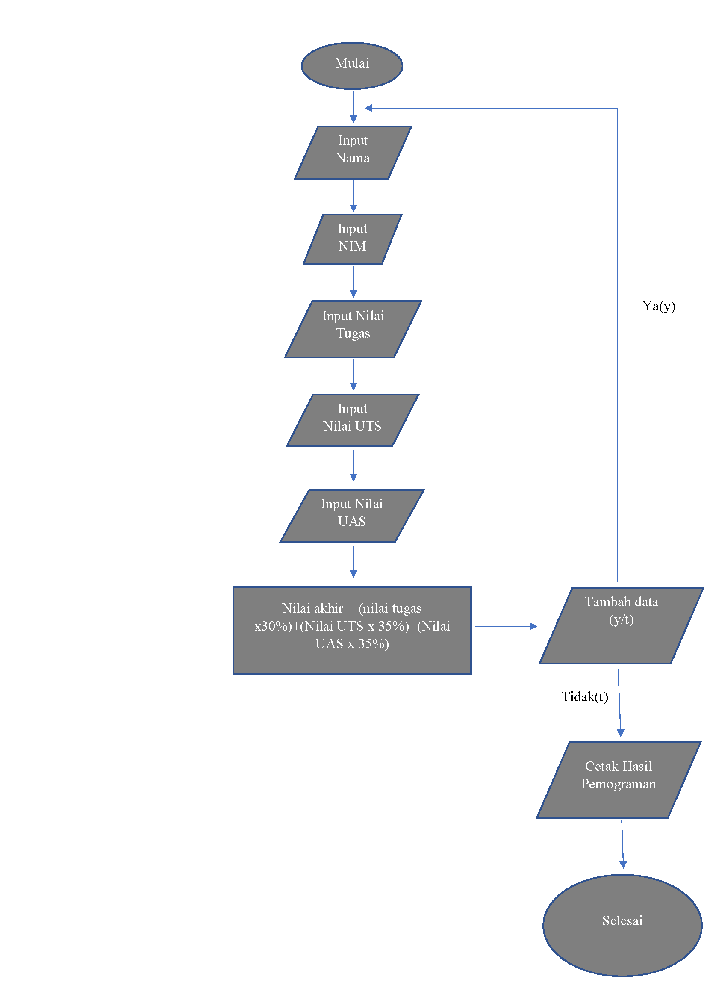

# Labspy4

# Latihan

-Ini adalah Latihan akses list dan ubah element

-ini adalah hasilnya

-ini adalah latihan tambah element list

-ini adalah hasilnya

# pratikum

-ini adalah flowchart listnilai mahasiswa

-ini adalah program nya

-ini adalah hasil programnya
